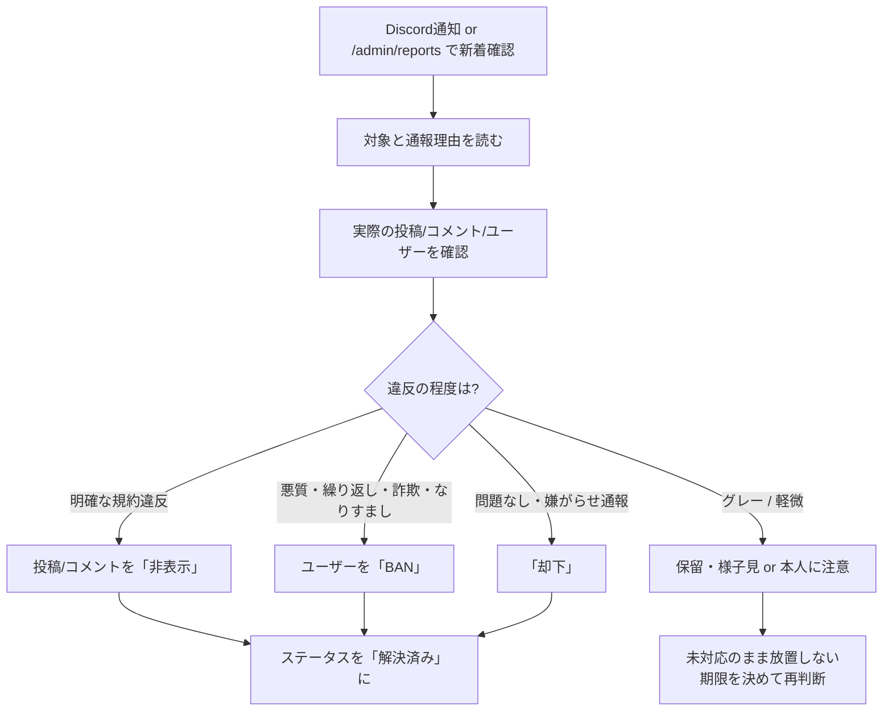

# 通報対応・運用フロー

WH Guide Australia の掲示板で「通報（report）」を受けたときに運営者が実施する対応をまとめたドキュメントです。実装（`reports` テーブル / Discord通知 / 管理画面 `/admin/reports`）に沿って運用してください。

---

## 1. 通報はどこに届くか

通報は次の3経路で確認できます。

| 経路 | 内容 |
| --- | --- |
| ① `reports` テーブル | ユーザーが通報すると `reporter_id` / `target_type` / `target_id` / `reason` / `status: "pending"` で記録される（永続的な記録・証跡） |
| ② Discord 通知 | `DISCORD_WEBHOOK_URL` 宛に即時通知（`kind: "report"`）。新着の見逃し防止に使う |
| ③ 管理画面 `/admin/reports` | `ReportsManager` で一覧・ステータス更新・対応操作を行うメイン窓口 |

- 通報対象は **投稿（post）/ コメント（comment）/ ユーザー（user）** の3種類。
- 自分の投稿・コメントには通報ボタンは表示されない（`ReportButton` の `authorId` 判定）。

---

## 2. 対応フロー（標準手順）

### ステップ1｜確認（トリアージ）
1. Discord通知または `/admin/reports` で「未対応（pending）」を確認する。
2. 通報対象（投稿 / コメント / ユーザー）と通報理由を読む。
3. 対象 ID から実際のコンテンツを開き、**自分の目で内容を確認**する。

### ステップ2｜判断
| ケース | 対応 |
| --- | --- |
| 明確な規約違反（誹謗中傷・スパム・違法情報・個人情報の晒し・露骨な内容） | 投稿/コメントを **非表示** |
| 悪質・繰り返し・詐欺・なりすまし・他者への危害 | ユーザーを **BAN** |
| グレー（軽微・解釈の余地あり） | **保留**して様子見、または本人に注意 |
| 嫌がらせ目的・実際は問題なし | **却下** |

### ステップ3｜アクション（`/admin/reports` のボタン）
| ボタン | 動作 | 補足 |
| --- | --- | --- |
| **非表示にする** | 対象を `is_hidden = true` に更新し、全ユーザーから見えなくする | 投稿/コメントのみ。実行後は自動で「解決済み」になる |
| **ユーザーをBAN** | `profiles.status = 'banned'` に更新 | 「ユーザー」通報のみ。登録電話番号も再登録ブロック対象になり、別アカウント再登録を防止。実行後は自動で「解決済み」 |
| **解決済み** | `status = 'resolved'`（`resolved_at` を記録） | 対応完了として記録 |
| **却下** | `status = 'rejected'` | 対応不要として記録 |

### ステップ4｜記録とクローズ
- すべての通報は最終的に **「解決済み」か「却下」** にし、未対応（pending）を残さない。
- 重大な対応（非表示・BAN）は判断根拠を一貫させる。
- 証跡（対象ID・通報理由・対応結果）は `reports` テーブルに残るため、再発時の判断材料になる。

---

## 3. 対応の優先順位とエスカレーション

被害の拡大を止めることを最優先にし、段階的に対応します。

1. **まず被害を止める** … 明確な違反は先に「非表示」でコンテンツを止める。
2. **悪質性が高い場合のみBAN** … 繰り返し・詐欺・なりすまし・危害は「ユーザーをBAN」。
3. **段階的対応を基本に** … 軽微なものは「注意 → 非表示 → BAN」の順で。いきなりBANは悪質ケースに限定。
4. **緊急性が高い内容**（違法行為・自傷他害・重大な個人情報漏えい）は即時に非表示／BANを実施し、必要に応じて警察等の外部窓口も検討する。

---

## 4. 判断基準（ガイドライン）

### 非表示にすべき例
- 誹謗中傷・差別・ハラスメント
- スパム・広告の大量投稿
- 違法行為の勧誘、無資格の金銭要求・詐欺的な募集
- 他人の個人情報（電話番号・住所・本名など）の無断掲載
- 露骨・不適切なコンテンツ

### BANすべき例
- 上記違反を繰り返すユーザー
- なりすまし・詐欺を目的としたアカウント
- 他ユーザーへの執拗な嫌がらせ・脅迫

### 却下すべき例
- 通報理由に該当する違反が確認できない
- 個人的な好き嫌い・意見の相違による通報
- 嫌がらせ目的の通報

---

## 5. BAN（利用停止）の効果

- `profiles.status = 'banned'` になると、対象ユーザーは投稿・コメントができなくなる（`is_active_user()` が false になるため RLS でブロック）。
- 登録電話番号が **再登録ブロック対象**（`banned_phones` / `is_phone_banned`）になり、同じ番号での新規登録を防止する。
- 解除が必要な場合は `profiles.status` を `'active'` に戻す（必要に応じて電話番号のブロックも解除）。

---

## 6. 関連する実装

| 項目 | 場所 |
| --- | --- |
| 通報ボタン | `components/forum/ReportButton.tsx` |
| 通報の管理画面 | `app/admin/reports/page.tsx` / `components/admin/ReportsManager.tsx` |
| 通報の通知 | `lib/notify.ts` / `app/api/notify/route.ts`（Discord Webhook） |
| RLS・モデレーション関数 | `supabase/migrations/0001_init.sql`（`is_active_user` / `is_moderator`） |
| 電話番号ブロック | `supabase/migrations/0002_moderation_phone_ban.sql`（`banned_phones` / `is_phone_banned`） |

---

## 7. 運用チェックリスト

- [ ] Discord通知をすぐ確認できる状態にしておく（通知ON）
- [ ] 新着通報は内容を必ず自分の目で確認する
- [ ] まず「非表示」で被害を止め、悪質な場合のみ「BAN」
- [ ] すべての通報を「解決済み」または「却下」でクローズする
- [ ] 重大ケース（違法・危害・個人情報漏えい）は即時対応＋外部窓口を検討
